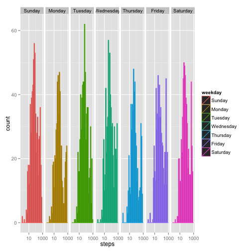
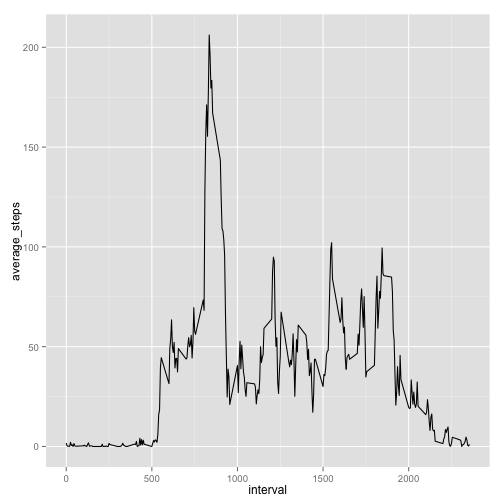
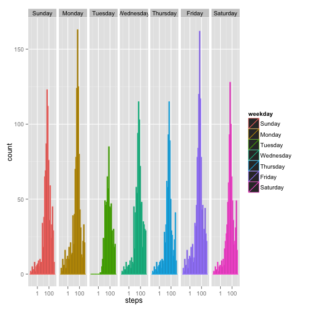
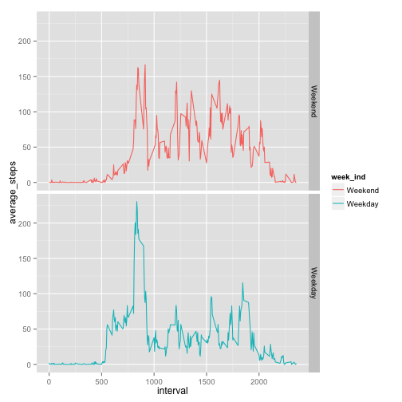

Peer Assessment 1
=======================================


### Loading and preprocessing the data

This code will load the necessary packages and read-in the Activity Monitoring dataset associated with this assignment.


```r
# Load the required packages
require(dplyr)
require(ggplot2)

# The read.csv function assumes the file is in your working directory and unzipped
activity_data <- read.csv("activity.csv", colClasses = c("numeric", "Date", "integer")) 

# Wrap data frame with dplyr table
activity_data <- tbl_df(activity_data) %>% # Chain to mutate function
      # Add weekday variable to data frame
      mutate(weekday = weekdays(date))

activity_data$weekday <- factor(activity_data$weekday, 
                              levels = c("Sunday", "Monday", "Tuesday", "Wednesday", 
                              "Thursday","Friday", "Saturday"))

activity_data <- activity_data[order(activity_data$weekday),]
```


### Mean total number of steps

Next, we will compute the average (i.e., mean) number of steps for each day of the week in the next chunk of code.


```r
# Group data by weekday variable
weekday_data <- group_by(activity_data, weekday)

# Calculate the total number of steps taken each day
summarize(weekday_data, sum(steps, na.rm = TRUE))
```

```
## Source: local data frame [7 x 2]
## 
##     weekday sum(steps, na.rm = TRUE)
## 1    Sunday                    85944
## 2    Monday                    69824
## 3   Tuesday                    80546
## 4 Wednesday                    94326
## 5  Thursday                    65702
## 6    Friday                    86518
## 7  Saturday                    87748
```

```r
# Plot histogram of steps taken per day
# Use log scale because of skew in the data
qplot(steps, data = weekday_data, facets = . ~ weekday, log = "x", color = weekday)
```

```
## stat_bin: binwidth defaulted to range/30. Use 'binwidth = x' to adjust this.
## stat_bin: binwidth defaulted to range/30. Use 'binwidth = x' to adjust this.
## stat_bin: binwidth defaulted to range/30. Use 'binwidth = x' to adjust this.
## stat_bin: binwidth defaulted to range/30. Use 'binwidth = x' to adjust this.
## stat_bin: binwidth defaulted to range/30. Use 'binwidth = x' to adjust this.
## stat_bin: binwidth defaulted to range/30. Use 'binwidth = x' to adjust this.
## stat_bin: binwidth defaulted to range/30. Use 'binwidth = x' to adjust this.
```

 

```r
# Calculate the mean and median number of steps for each weekday
summarize(weekday_data, mean(steps, na.rm = TRUE), median(steps, na.rm = TRUE))
```

```
## Source: local data frame [7 x 3]
## 
##     weekday mean(steps, na.rm = TRUE) median(steps, na.rm = TRUE)
## 1    Sunday                  42.63095                           0
## 2    Monday                  34.63492                           0
## 3   Tuesday                  31.07485                           0
## 4 Wednesday                  40.94010                           0
## 5  Thursday                  28.51649                           0
## 6    Friday                  42.91567                           0
## 7  Saturday                  43.52579                           0
```


### Average daily activity pattern

Next, we will analyze the data for daily activity patterns. We identify the 5-minute interval with the maximum number of steps (based on the average across all days).


```r
# Group the activity data by time intervals
interval_data <- group_by(activity_data, interval)

# Summarize data for each interval with the average number steps (averaged across days)
int_steps_data <- summarize(interval_data, 
                            mean(steps, na.rm = TRUE))

# Rename summary column to "average_steps"
names(int_steps_data)[2] <- "average_steps"

qplot(interval, average_steps,  data = int_steps_data, geom = "path")
```

 

```r
# Identify index of time interval with maximum average-steps
max_steps <- max(int_steps_data$average_steps)
max_index <- which(int_steps_data$average_steps == max_steps)
max_interval <- int_steps_data$interval[max_index]
```

The interval with the maximum number of steps (206.1698113 steps) begins at 835 and ends at 840.


### Imputing missing values

The below code calculates and reports the total number of missing values and then imputes replacement values.  Specifically, the imputed values are the estimated to be the average value for a specified interval (averaged across all days).


```r
# Count and print the total number of NAs in the data frame
total_NA <- sum(is.na(activity_data))
print(total_NA)
```

```
## [1] 2304
```

```r
# Impute missing value
imputed_data <- activity_data
      
# Determine indices of missing values
index_NA <- which(is.na(activity_data$steps))
      
# Subset data based on matching indices
interval_matches <- 
      match(activity_data$interval[index_NA], 
            int_steps_data$interval)

# Replace NAs with average steps for that interval
imputed_data[index_NA, 1] <- int_steps_data[interval_matches, 2]
```

In the following chunk of code, the imputed data set is:
1. Grouped by weekday
2. Summarized by the total number of steps taken per day
3. Visualized in histograms for each day
4. Summarized by the mean and median number of steps per day


```r
# Group data by weekday variable
weekday_imp_data <- group_by(imputed_data, weekday)

# Calculate the total number of steps taken each day
summarize(weekday_imp_data, sum(steps, na.rm = FALSE))
```

```
## Source: local data frame [7 x 2]
## 
##     weekday sum(steps, na.rm = FALSE)
## 1    Sunday                  96710.19
## 2    Monday                  91356.38
## 3   Tuesday                  80546.00
## 4 Wednesday                 105092.19
## 5  Thursday                  76468.19
## 6    Friday                 108050.38
## 7  Saturday                  98514.19
```

```r
# Plot histogram of steps taken per day
# Use log scale because of skew in the data
qplot(steps, data = weekday_imp_data, 
      facets = . ~ weekday, log = "x", color = weekday)
```

```
## stat_bin: binwidth defaulted to range/30. Use 'binwidth = x' to adjust this.
## stat_bin: binwidth defaulted to range/30. Use 'binwidth = x' to adjust this.
## stat_bin: binwidth defaulted to range/30. Use 'binwidth = x' to adjust this.
## stat_bin: binwidth defaulted to range/30. Use 'binwidth = x' to adjust this.
## stat_bin: binwidth defaulted to range/30. Use 'binwidth = x' to adjust this.
## stat_bin: binwidth defaulted to range/30. Use 'binwidth = x' to adjust this.
## stat_bin: binwidth defaulted to range/30. Use 'binwidth = x' to adjust this.
```

 

```r
# Calculate the mean and median number of steps for each weekday
summarize(weekday_imp_data, mean(steps, na.rm = FALSE),
          median(steps, na.rm = FALSE))
```

```
## Source: local data frame [7 x 3]
## 
##     weekday mean(steps, na.rm = FALSE) median(steps, na.rm = FALSE)
## 1    Sunday                   41.97491                            0
## 2    Monday                   35.24552                            0
## 3   Tuesday                   31.07485                            0
## 4 Wednesday                   40.54483                            0
## 5  Thursday                   29.50162                            0
## 6    Friday                   41.68610                            0
## 7  Saturday                   42.75789                            0
```

If we compare the summaries with and without the missing data we observe small differences between the average number of steps taken per day.  See the `difference` column in the below output; in some cases, averages went up and in others, averages went down.


```r
# Store the summary data when NAs are removed
with_NAs <- summarize(weekday_data, mean(steps, na.rm = TRUE))
# Rename summary column
names(with_NAs)[2] <- "with_NAs"

# Store the summary data when NAs are removed
without_NAs <- summarize(weekday_imp_data, 
                         mean(steps, na.rm = FALSE))[,2]
# Rename summary column
names(without_NAs) <- "without_NAs"

# Combine summaries into one data frame and compute difference between means
comparison <- cbind(with_NAs, without_NAs)
comparison <- mutate(comparison, difference = with_NAs - without_NAs)

# Reorder output by and display
comparison$weekday <- 
      factor(comparison$weekday, 
             levels = c("Sunday", "Monday", "Tuesday", "Wednesday", 
                        "Thursday","Friday", "Saturday"))
comparison[order(comparison$weekday),]
```

```
##     weekday with_NAs without_NAs difference
## 1    Sunday 42.63095    41.97491  0.6560441
## 2    Monday 34.63492    35.24552 -0.6105953
## 3   Tuesday 31.07485    31.07485  0.0000000
## 4 Wednesday 40.94010    40.54483  0.3952783
## 5  Thursday 28.51649    29.50162 -0.9851229
## 6    Friday 42.91567    41.68610  1.2295722
## 7  Saturday 43.52579    42.75789  0.7678993
```


### Differences in activity patterns

An individual's activity patterns vary depending on the day. The chunk below labels the data into "weekend" and "weekday" factors and produces a plot that shows the average number of steps for each time interval.


```r
# Create weekend character vector
weekend <- c("Sunday", "Saturday")

# Assign factor variables
week_ind <- factor(activity_data$weekday %in% weekend, 
              levels = c(TRUE, FALSE), labels = c("Weekend", "Weekday"))

# Bind factor data to 'imputed_data' dataframe
act_week <- cbind(imputed_data, week_ind)
# Group dataframe by weekend/weekday indicator and interval
act_week <- group_by(act_week, week_ind, interval)

# Summarize data by averaging steps per interval across days (i.e., weekends or weekdays)
act_week_sum <- summarize(act_week, mean(steps))
names(act_week_sum)[3] <- "average_steps"

# Plot weekday and weekend steps and facet the plot based on those factors
qplot(interval, average_steps, data = act_week_sum, 
      facets = week_ind ~., geom = "path", color = week_ind)
```

 

On weekdays, people tend to accumulate steps earlier in the day.  Activity during the middle of the day is relatively low compared to the high step counts seen in the morning.  On the weekend, individuals begin to accumulate steps later in the morning (perhaps after sleeping in).
